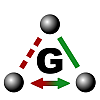

# GGL - the Graph Grammar Library



The GGL (Graph Grammar Library) is an object oriented ANSI C++ library to 
implement and apply graph rewrite systems. It implements a Double Push Out 
(DPO) approach. The library is highly modular and uses state-of-the-art 
algorithms and data structures. To this end, it uses the 
[Boost Graph Library](http://www.boost.org/) 
(BGL) for the internal graph representation and efficient (sub)graph isomorphism 
approaches as the VF2 algorithm.


Beside its general applicability, it features an extensive chemistry module to 
handle grammar-based graph transformation in Chemistry. Since a chemical 
reaction can be viewed as graph transformation from the set of educt graphs to 
the set of product graphs, the GGL can be used to iteratively expand the 
topology of chemical reaction network, starting from a set of chemical 
reactions (graph rewrite rules) and set of molecules (vertex and edge 
labeled graphs) using the general DPO framework of the GGL.

Furthermore, the GGL chemistry module sports efficient cheminformatics 
algorithms, for instance to estimate reaction rates or a molecule's energy 
or aromaticity. Furthermore, it comes with a port to the well established 
[Open Babel Library](http://openbabel.org/).

The GGL can processes molecules in [SMILES](http://www.opensmiles.org/) or 
[GML](http://www.fim.uni-passau.de/en/fim/faculty/chairs/theoretische-informatik/projects.html) 
format. Graph rewrite rules are usually formulated in GML. 

#### Contact
- [Martin Mann](http://www.bioinf.uni-freiburg.de/~mmann) - @martin-mann
- [Christoph Flamm](http://www.tbi.univie.ac.at/~xtof/) - @xtof

## Literature

- [Atom mapping with constraint programming](http://dx.doi.org/10.1186/s13015-014-0023-3)
Martin Mann, Feras Nahar, Norah Schnorr, Rolf Backofen, Peter F Stadler and Christoph Flamm.
Algo Mol Biol 9:23, (2014).
- [The Graph Grammar Library - a generic framework for chemical graph rewrite systems](http://dx.doi.org/10.1007/978-3-642-38883-5_5) 
Martin Mann, Heinz Ekker, and Christoph Flamm.
In Proc. of International Conference on Model Transformation (ICMT) 2013, LNCS, to appear, (2013).
- [In silico Evolution of early Metabolism](http://dx.doi.org/10.1162/artl_a_00021)
Alexander Ullrich, Markus Rohrschneider, Peter F Stadler, and Christoph Flamm.
Artifical Life 17(2):87-108, (2011).
- [Evolution of Metabolic Networks: A Computational Framework](http://dx.doi.org/10.1186/1759-2208-1-4)
Christoph Flamm, Alexander Ullrich, Heinz Ekker, Martin Mann, Daniel Högerl, Markus Rohrschneider, Sebastian Sauer, Gerik Scheuermann, Konstantin Klemm, Ivo L. Hofacker, and Peter F. Stadler.
J Sys Chem 1:4, (2010).
- [A Graph-Based Toy Model of Chemistry](http://dx.doi.org/10.1021/ci0200570)
Gil Benkö, Christoph Flamm and Peter F. Stadler.
J Chem Inf Comput Sci., 43(4):1085-1093, (2003).


## Download and installation

### Dependencies

- [Boost Library](http://www.boost.org/)
- [Open Babel Library](http://openbabel.org/) (optionally)
- GNU autotools (if compiling from GIT repository clone)

### Release package source code distribution (`ggl-VERSION.tar.gz`)

The provided source code distributions of the GGL (file names `ggl-VERSION.tar.gz`)
are autotools generated packages ready for the standard compilation-installation
procedure:

```bash
tar -xzf ggl-VERSION.tar.gz
cd ggl-VERSION
./configure  # call with '--help' for configure options
make
make install # call with 'prefix=INSTALLPREFIX' for local installation
```
 
### Clone or Source from github

The source files hosted on github (and available as `Source.zip` from the release
pages) have to be preprocessed with autotools to enable the
standard compilation-installation pipeline:

```bash
source ./autogen.sh  # calls autotools, see content for details
./configure  # call with '--help' for configure options
make
make install # call with 'prefix=INSTALLPREFIX' for local installation
```


<hr>

# Library descriptions

The package comes with separate libraries described in the following. Furthermore,
generic binaries are compiled that directly enable graph rewrite applications.

[Library API](http://www.tbi.univie.ac.at/software/GGL/API/index.html) 
and [tutorial/manual](http://www.tbi.univie.ac.at/software/GGL/) generation is 
part of the source code package as well (linked versions might be not recent). 

## SGM - Sub Graph Matching  

A library to solve the subgraph-isomorphism problem based on different 
approaches.

#### Features:
 - `Graph_Interface` : an abstract graph interface used by the matching algorithms
 - `SubGraphMatching` : an abstract interface of sub graph matching algorithms
 - `Match_Reporter` : an abstract interface to handle a found match
 
#### Implementations:
 - `Graph_boost` : a `Graph_Interface` implementation wrapping around a boost graph
 - `Graph_boostV` : a `Graph_Interface` implementation wrapping around a set of 
   boost graphs to be represented as one graph with independent components
 - `SGM_vf2` : a VF2-lib based `SubGraphMatching` implementation
 - `MR_stream` : a `Match_Reporter` that writes each reported match to stream
 

##  GGL - Graph Grammar Library
  
A library to formulate and solve context sensitive graph grammars.

#### Features:
 - `Graph` : a labeled undirected boost graph used for grammar targets
 - `Rule` : a graph grammar rule encoding based on an undirected labeled BGL graph
 - `MR_ApplyRule` : an `sgm::Match_Reporter` implementation that applies a rule onto
   a matched subgraph that was identified by a `sgm::SubGraphMatching` object
 - `Graph_Storage` : an abstract interface that is used by `MR_ApplyRule` to report
   the newly generated graphs that are the result of a grammar rule application
 
#### Implementations:
 - `GraphTarget` : an `sgm::Graph_Interface` wrapper around a Graph for SGM usage
 - `LeftSidePattern` : an `sgm::Graph_Interface` wrapper around a Rule for SGM usage
 - `GS_stream` : a `Graph_Storage` implemenation that writes all reported graphs to
   stream
 - `Rule_GML_grammar` : a parser grammar definition for GML encoded rule parsing
 

##  GGL-CHEM - GGL Chemistry
  
A library to formulate chemical reactions on molecule graphs using graph 
grammar rules. 

#### Features:
 - `Molecule` : a labeled undirected boost graph used for molecule graph 
   representation
 - `SMILES_grammar` : a parser grammar defintion for Daylight's SMILES molecule
   string representation parsing
 - `SMILESwriter` : a writer to encode molecule graphs in canonical SMILES strings.
   Note: the write is incomplete, i.e. only handles a few types of atoms
 - `GS_SMILES` : a `ggl::Graph_Storage` implementation that rewrites each generated
   Molecule into a SMILES string and adds it into an STL container
 

